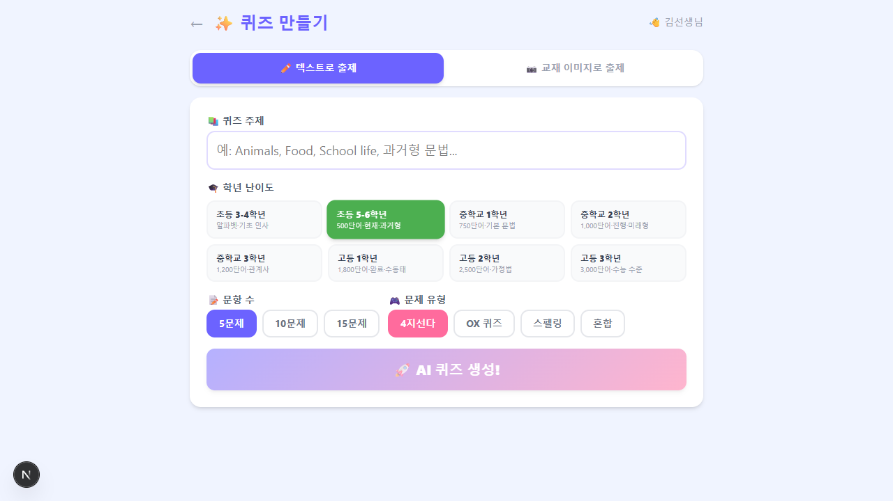
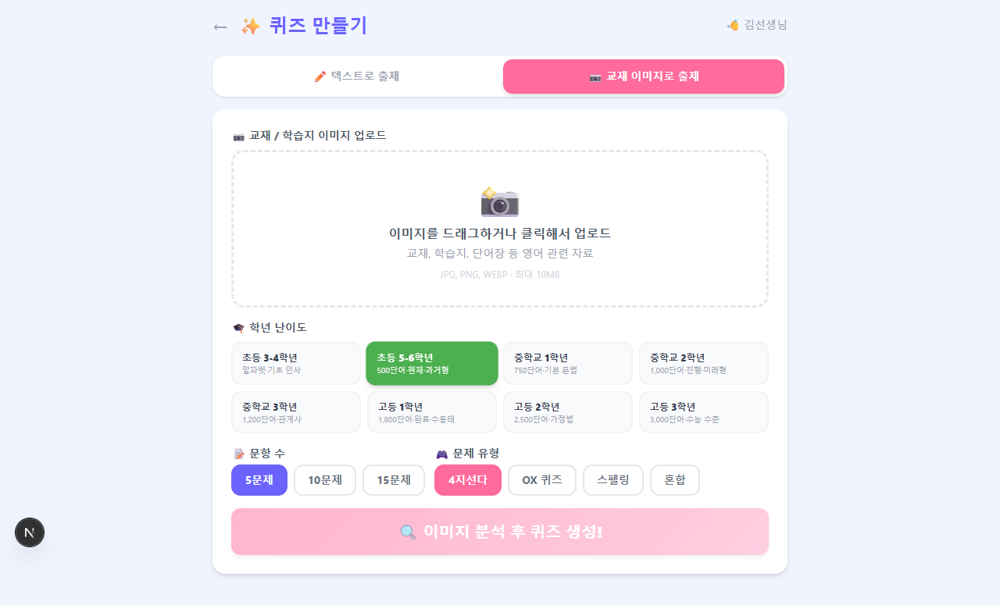

# 🏆 영어챔피언 (English Champion)

> **AI 영어 퀴즈 플랫폼** — 교수자가 주제나 교재 이미지를 입력하면 AI가 즉석에서 영어 퀴즈를 생성하고, 학습자는 닉네임과 PIN 코드만으로 즉시 참여할 수 있는 가벼운 웹 서비스입니다.

---

## 📸 화면 미리보기

### 메인 홈 화면


### 교수자 로그인


### 퀴즈 생성 — 텍스트 모드


### 퀴즈 생성 — 교재 이미지 모드


### 학습자 입장


---

## ✨ 주요 기능

### 👩‍🏫 교수자 기능
| 기능 | 설명 |
|------|------|
| **AI 퀴즈 자동 생성** | 주제(텍스트) 입력만으로 10초 내 고품질 퀴즈 생성 |
| **교재 이미지 분석** | 교재·학습지 사진을 업로드하면 GPT-4o Vision이 내용을 분석해 문제 출제 |
| **학년 난이도 설정** | 초등 3-4학년 ~ 고등 3학년까지 대한민국 공교육 교육과정 기준 8단계 |
| **문제 유형 선택** | 4지선다 / OX 퀴즈 / 스펠링 / 혼합 |
| **인라인 편집** | 생성된 문제를 카드에서 바로 클릭해 수정 |
| **PIN 코드 발급** | 퀴즈 확정 시 6자리 고유 PIN 자동 발급 |
| **실시간 리더보드** | Firebase 기반 실시간 참여자 점수·순위 모니터링 |
| **진행 방식 선택** | 교사 주도(문제 전환 직접 제어) / 자기 주도(학생 페이스) |
| **타이머 설정** | 문제당 20초 / 30초 / 60초 선택 |

### 🧒 학습자 기능
| 기능 | 설명 |
|------|------|
| **가입 없이 즉시 참여** | 닉네임 + 6자리 PIN 코드만으로 입장 |
| **실시간 퀴즈 응시** | 타이머, 즉각 정오답 피드백, 점수 산정 |
| **발음 듣기** | 문제·선택지·정답을 클릭하면 미국 영어 여성 음성으로 읽어줌 |
| **최종 결과 확인** | 점수 및 전체 순위 표시 |

---

## 🎓 학년별 난이도 기준 (교육부 고시)

| 학년 | 어휘 수준 | 핵심 문법 |
|------|----------|-----------|
| 초등 3-4학년 | ~240단어 | 알파벳·파닉스·기초 인사 |
| 초등 5-6학년 | ~500-600단어 | 현재·과거형, 조동사 |
| 중학교 1학년 | ~750단어 | be동사·진행형·미래형 |
| 중학교 2학년 | ~1,000단어 | 현재완료·to부정사·비교급 |
| 중학교 3학년 | ~1,200단어 | 관계대명사·분사·수동태 |
| 고등학교 1학년 | ~1,800단어 | 완료 심화·수능 기초 |
| 고등학교 2학년 | ~2,500단어 | 가정법·분사구문·EBS 수준 |
| 고등학교 3학년 | ~3,000단어+ | 수능 전 유형 완성 |

---

## 🛠️ 기술 스택

| 영역 | 기술 |
|------|------|
| **Frontend** | Next.js 16 (App Router) + TypeScript |
| **스타일링** | TailwindCSS |
| **AI 퀴즈 생성** | OpenAI GPT-4o (텍스트 + Vision) |
| **실시간 DB** | Firebase Firestore |
| **발음 TTS** | Web Speech API (브라우저 내장) |

---

## 🚀 로컬 실행 방법

### 1. 저장소 클론 및 패키지 설치

```bash
cd quiz-pang
npm install
```

### 2. 환경 변수 설정

`.env.local` 파일을 생성하고 아래 내용을 채웁니다:

```env
# OpenAI API Key
OPENAI_API_KEY=your_openai_api_key_here

# Firebase 설정
NEXT_PUBLIC_FIREBASE_API_KEY=your_firebase_api_key
NEXT_PUBLIC_FIREBASE_AUTH_DOMAIN=your_project.firebaseapp.com
NEXT_PUBLIC_FIREBASE_PROJECT_ID=your_project_id
NEXT_PUBLIC_FIREBASE_STORAGE_BUCKET=your_project.firebasestorage.app
NEXT_PUBLIC_FIREBASE_MESSAGING_SENDER_ID=your_sender_id
NEXT_PUBLIC_FIREBASE_APP_ID=your_app_id
```

### 3. Firebase Firestore 설정

1. [Firebase 콘솔](https://console.firebase.google.com) 접속
2. **Firestore Database** → **데이터베이스 만들기**
3. **테스트 모드**로 시작
4. Firestore **규칙** 탭에서 아래로 설정 후 게시:

```
rules_version = '2';
service cloud.firestore {
  match /databases/{database}/documents {
    match /{document=**} {
      allow read, write: if true;
    }
  }
}
```

### 4. 개발 서버 실행

```bash
npm run dev
```

브라우저에서 [http://localhost:3000](http://localhost:3000) 접속

---

## 📖 사용 방법

### 교수자 플로우

```
홈 → 교수자 선택 → 닉네임 + 세션 비밀번호 입력
  → 퀴즈 주제 입력 (또는 교재 이미지 업로드)
  → 학년 난이도·문항 수·유형 선택
  → AI 퀴즈 생성 → 문제 검토·편집
  → 방 만들기 → 6자리 PIN 발급
  → 실시간 리더보드 모니터링
```

### 학습자 플로우

```
홈 → 학습자 선택 → 닉네임 + PIN 코드 입력
  → 퀴즈 즉시 시작
  → 문제 풀기 (타이머, 발음 듣기 활용)
  → 즉각 정오답 피드백
  → 최종 점수 및 순위 확인
```

---

## 📁 프로젝트 구조

```
quiz-pang/
├── app/
│   ├── page.tsx                        # 홈 (교수자/학습자 선택)
│   ├── layout.tsx                      # 루트 레이아웃
│   ├── globals.css                     # 전역 스타일
│   ├── instructor/
│   │   ├── create/page.tsx             # 퀴즈 생성·편집 화면
│   │   └── room/[pin]/page.tsx         # 방 관리 + 실시간 리더보드
│   ├── learner/
│   │   └── quiz/[pin]/page.tsx         # 학습자 퀴즈 플레이 화면
│   └── api/
│       └── generate-quiz/route.ts      # OpenAI 퀴즈 생성 API
├── components/
│   └── SpeakButton.tsx                 # 영어 발음 TTS 버튼
├── lib/
│   ├── firebase.ts                     # Firebase 설정
│   └── useTTS.ts                       # Web Speech API 훅
├── types/
│   └── quiz.ts                         # TypeScript 타입 정의
└── public/
    └── screenshots/                    # README 스크린샷
```

---

## 🔒 보안 및 데이터 정책

- **개인정보 미수집**: 이메일·성명·전화번호 등 개인식별정보(PII) 일체 수집하지 않음
- **비회원제**: 닉네임만으로 참여, 별도 회원가입 불필요
- **API 키 보호**: `.env.local`은 `.gitignore`에 포함되어 저장소에 커밋되지 않음

---

## 📜 라이선스

MIT License
